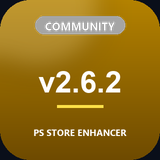
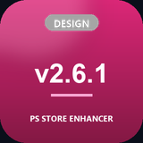
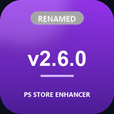
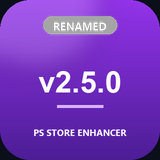
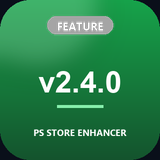
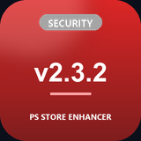
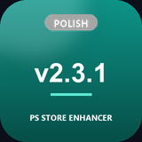
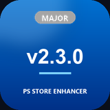
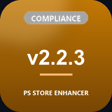
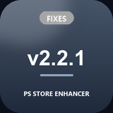

# Changelog

All notable changes to **PS Store Enhancer** (formerly GameDeals+, then PS Store Insight), in
plain language. This file is the readable version of the in-extension changelog — see
[`extension/changelog.html`](extension/changelog.html) for the same content as it appears inside
the popup/options pages.

---

## v2.6.2 — Repo, docs & support links

No functional changes to the extension's PS Store features in this release.

- **GitHub repo renamed** to match the product name.
- **This file** — the full version history in plain, readable Markdown, linked from the README,
  the website, and the in-extension changelog page.
- **A unique badge per release** — every version here has its own small graphic (color +
  category + version number), so the history is easier to scan at a glance.
- **README overhaul** — added the extension's icon, fixed several stale details (locale key
  counts, project structure, a couple of missing APIs), and linked this changelog.
- **Support links updated** — added Ko-fi and Buy Me a Coffee alongside a corrected Patreon URL,
  replacing the old one everywhere it appeared.

 

---

## v2.6.1 — New look

No functional changes to the extension itself — this release is entirely visual/branding polish.

- **New icon** — cleaner mark, still recognizable at 16px in the toolbar.
- **Updated screenshots and promotional images** for the Chrome Web Store listing, including
  Hebrew-localized versions, all built from the extension's real UI and colors rather than
  generic mockups.
- **Expanded website** — the landing page now shows real screenshots of every major feature
  (product page cards, live search, the stats dashboard, the popup) instead of icon-only
  feature tiles.

 

---

## v2.6.0 — Renamed, again (hopefully for the last time)

- **PS Store Insight is now PS Store Enhancer** — same extension, same developer. Shorter, and
  says exactly what it does: it enhances the PlayStation Store page you're already on. Nothing
  about your settings, PSN connection, wishlist, or owned-games list changes. Backups exported
  under either older name still import correctly.

 

---

## v2.5.0 — Renamed, and a real feature drop

- **GameDeals+ is now PS Store Insight** — same extension, same developer, same free/open-source
  project. The new name better reflected what it actually does.

**New**
- 🔎 **Live search suggestions** — as you type in the PS Store search box, an enriched dropdown
  shows box art and the cheapest PC price for matching titles. Selecting one jumps straight to
  PS Store's own search results. No new permissions required.
- 🎉 **"What's new" surfaces automatically** — after any update, a highlight card appears in the
  popup and a dismissible banner appears on the store page.
- 📊 **Library & Wishlist stats** — a dashboard on the settings page shows games owned, wishlist
  size, total wishlist value, and deals ready to buy — all computed from data already fetched,
  no extra API calls.
- 🔔 **Toolbar badge** — the extension icon shows a live count of wishlist deals at or below
  your target price (green), or a dot when there's an unread "what's new" (red).
- 🎁 **Edition transparency** — cross-platform price rows are tagged when a listing is for a
  different bundle/edition (Deluxe, Ultimate, GOTY, etc.) than the page you're viewing.
- ♿ **Accessibility** — every settings toggle has a screen-reader label; the search-suggestions
  dropdown uses listbox/option roles with keyboard selection state.

**Deliberately not included, and why**
Importing your PSN wishlist automatically and per-trophy rarity percentages both need real
testing against Sony's private API, which can't be verified without a live PSN account in the
loop — shipping either blind risks the kind of reviewer-facing breakage this project hit before.
A Firefox port is parked for the same reason. Edge already works today since it's Chromium-based
— no code changes needed, just a separate store listing.

 

---

## v2.4.0

- **Wishlist notifications are now clickable** — clicking a price-drop alert opens that game's
  PlayStation Store page.
- **"Check prices now" button** — manually refresh all wishlist prices from the options page
  instead of waiting for the daily check.
- **Support the project** — added a donation link in the popup, options, welcome page, and
  landing page. The extension stays free and open-source either way.

 

---

## v2.3.2 — Security & compliance

- **MV3 CSP fix** — moved the welcome page and changelog page scripts out of inline
  `<script>` blocks (which Manifest V3 blocks) into external files. The welcome page's
  "Open Settings" button and the changelog's theme detection actually work now.
- **Attribute-safe escaping** — `esc()` / `escapeHtml()` now escape quotes too, hardening
  against markup-breakout from unusual game titles.
- **Privacy policy refreshed** — now lists notifications, contextMenus, the currency-rate
  endpoint, and the daily wishlist price checks; removed a stale unused-permission entry.

 

---

## v2.3.1 — UX honesty & dev infrastructure

**UX honesty & clarifications**
- **Wishlist disclaimer** — the wishlist UI now clearly states alerts use cross-platform PC
  prices (Steam/Epic/GOG, USD). PSN-only prices aren't tracked.
- **HowLongToBeat link** — the trophy card now links out for accurate playtime data.
- **"What's new" popup on minor/major updates.**
- **Keyboard shortcut** — Alt+Shift+G opens the popup.
- **Import loading state** — the Import button spinner runs while JSON is parsed.

**Developer experience**
- Pure helpers (`slugify`, `fuzzyMatch`, `computeBasePrice`, `classifyTitle`) extracted for
  unit testing, with 21 Jest tests covering the matching/pricing/classification logic.
- ESLint + Prettier configs; CI runs lint + tests + locale validation on every PR.
- GitHub Actions release workflow — push a `v*` tag, get a Release with both zips attached.
- GitHub Pages live with a landing page + privacy policy.
- Hebrew README, CONTRIBUTING guide, issue templates.

 

---

## v2.3.0

**New features**
- ⭐ **Wishlist with price alerts** — track games, get a desktop notification when the
  cross-platform cheapest price drops below your target.
- 💱 **Display currency** — convert cross-platform prices to your local currency (18 supported),
  powered by daily exchange rates.
- 🎨 **Light theme** — Auto / Dark / Light, applied consistently across the extension.
- 🌍 **Auto-detect region** — picked up from the PS Store URL on first visit.
- 🖱️ **Right-click search** — highlight any text, right-click to price-compare it.
- 📤 **Backup & Restore** — export owned games and wishlist to JSON, restore anytime.

**Improvements**
- Trophy database expanded with 50+ popular PS5 titles.
- Cross-platform card shows a currency tag and converts prices using daily rates.
- Search-grid filtering debounced and moved to `requestIdleCallback` — lower CPU on infinite
  scroll.
- Friendlier error messages when upstream APIs are temporarily down.
- Theme-aware injected cards.

 

---

## v2.2.3 — Compliance & review-friction fixes

- De-emphasized PSN integration in the description and UI — clearly marked Optional/Advanced.
- Added NPSSO format validation to catch invalid tokens before hitting Sony's API.
- Friendlier error messaging for PSN auth failures.
- Shortened the extension description in 5 locales to fit the Chrome Web Store's character limit.
- Added reviewer notes for the Chrome Web Store review team.

 

---

## v2.2.2

- Removed an unused permission that a Chrome Web Store automated review had flagged.
- Removed an unused host permission.

 

---

## v2.2.1

- i18n: replaced hardcoded Hebrew error strings with proper locale keys.
- RTL: cards now respect the user's selected language direction (was hardcoded RTL).
- PSN: trophy lookup now paginates through up to 1500 titles (was capped at 50).
- PSN: library cap raised from 2000 to 5000 titles.
- PSN: owned-games list now excludes DLC, avoiding false filter matches.
- Price chart transparently tagged as "Estimated history."
- Better base-price formula for indie vs. AAA games.
- Stricter fuzzy-match threshold with a length-ratio check.
- Avatar URL XSS hardening.
- Background message handler now catches handler errors.

 

---

*PS Store Enhancer is not affiliated with, endorsed by, or connected to Sony Interactive
Entertainment, PlayStation, or any of their subsidiaries.*
