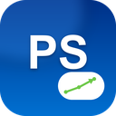

<p align="center"></p>

<h1 align="center">🎮 PS Store Enhancer</h1>

<p align="center">Formerly GameDeals+, then PS Store Insight. Enhance your PlayStation™ Store experience with price history, cross-platform comparison, review scores, trophy info, wishlist alerts, currency conversion, and smart filters.</p>

<p align="center">


<a href="https://github.com/DrummingBird1/ps-store-enhancer/actions/workflows/ci.yml"></a>
</p>

<p align="center">
🌐 <a href="https://drummingbird1.github.io/ps-store-enhancer/"><b>Landing page</b></a> ·
📝 <a href="CHANGELOG.md">Changelog</a> ·
🔒 <a href="https://drummingbird1.github.io/ps-store-enhancer/privacy-policy.html">Privacy policy</a> ·
📖 <a href="README.he.md">README בעברית</a>
</p>

<p align="center">
❤️ Support this project — <a href="https://ko-fi.com/idanlights">Ko-fi</a> · <a href="https://buymeacoffee.com/MrIdan">Buy Me a Coffee</a> · <a href="https://www.patreon.com/c/IdanLights">Patreon</a>
</p>

---

## ✨ Features

| Feature | Description |
|---------|-------------|
| 🔎 **Live Search Suggestions** | Enriched dropdown (thumbnail + PC price) as you type in the store search box |
| 📉 **Price History** | Embedded sparkline chart with 12-month history + lowest-ever price |
| 🔀 **Cross-Platform** | Price comparison table — Steam, Epic, GOG, Humble (CheapShark API) |
| 🎁 **Edition Transparency** | Flags cross-platform prices that are for a different bundle/edition (Deluxe, GOTY, etc.) than the page you're on |
| 📊 **Review Scores** | OpenCritic / Metacritic badge next to game title |
| 🏆 **Trophy Info** | Platinum, difficulty, time estimate + live PSN progress bar |
| 🔗 **PSN Sync** | Connect PSN account to auto-sync game library & DLCs |
| ✓ **Mark as Owned** | One-click button on product pages |
| 📈 **Library & Wishlist Stats** | Dashboard: games owned, wishlist size, total wishlist value, deals ready to buy |
| 🔔 **Toolbar Badge** | Live count of wishlist deals at/below target price on the extension icon |
| 🧹 **Smart Filters** | Hide add-ons, DLC, currency packs, and owned games |
| 🗣️ **10 Languages** | EN, HE, AR, ES, FR, DE, PT-BR, RU, JA, KO + manual selector |
| 💾 **Smart Cache** | TTL-based caching (4h–7d) with cache management UI |

---

## 📁 Project Structure

```
gamedeals-plus/
├── extension/                  ← Chrome extension (load this in developer mode — the source of truth)
│   ├── manifest.json           Manifest V3
│   ├── background.js           Service worker — API proxy, PSN sync, wishlist, alarms
│   ├── content.js              DOM injection — cards, badges, filters, live search
│   ├── styles.css              PlayStation-themed styles
│   ├── psn.js                  PSN authentication & library API
│   ├── cache.js                Smart cache with TTL
│   ├── match.js                Pure helpers (slugify/fuzzyMatch/detectEdition/…), unit-tested
│   ├── i18n.js                 Multi-language support with manual override
│   ├── popup.html / .js        Quick controls popup
│   ├── options.html / .js      Full settings page + Library & Wishlist stats
│   ├── welcome.html            Onboarding page (shown on first install)
│   ├── changelog.html / .js    In-extension "what's new" page
│   ├── icons/                  Extension icons (16, 48, 128)
│   └── _locales/               10 language translations (185 keys each)
│
├── assets/                     ← Everything for the Chrome Web Store listing & social media
│   ├── README.md               What's here and why (incl. why docs/assets/ duplicates a few files)
│   ├── STORE-LISTING.txt       Full description, privacy justifications
│   ├── REVIEWER-NOTES.md       Notes for Chrome Web Store reviewers
│   ├── icon.png, store-icon-128.png   Logo / store listing icon
│   ├── badges/                 One graphic per released version, used in CHANGELOG.md
│   ├── promo/                  Promotional tiles (440×280 small, 1400×560 marquee)
│   └── screenshots/en, /he     Store screenshots, per language
│
├── dist/                       ← Latest build output (git-ignored, regenerate with scripts/build.py)
│   ├── ps-store-enhancer-vX.Y.Z.zip   Ready to upload to the Chrome Web Store
│   └── extension/              Same thing, unpacked (for quick "Load unpacked" testing)
│
├── archive/                    ← Superseded assets kept for reference (old icons, old docs, etc.)
│
├── scripts/
│   └── build.py                Builds dist/ from extension/
│
├── docs/                       ← GitHub Pages site (paths here are constrained to this folder)
│   ├── index.html              Landing page (feature tour + screenshots)
│   ├── privacy-policy.html     Privacy policy
│   └── assets/                 Website-only image copies (GitHub Pages can't serve outside docs/)
│
├── tests/                      Jest unit tests
├── .github/workflows/          CI (lint+tests on PR) + Release (build + publish on tag)
├── CHANGELOG.md                Full version history, human-readable
├── TESTING.md                  Manual browser test checklist
├── .gitignore
├── LICENSE
└── README.md                   This file
```

---

## 🚀 Installation

### For Development / Testing

1. Clone this repo
2. Open `chrome://extensions`
3. Enable **Developer mode**
4. Click **Load unpacked** → select the `extension/` folder
5. Navigate to [store.playstation.com](https://store.playstation.com)

### From Chrome Web Store

*(Link will be added after publishing)*

---

## 🔗 PSN Account Connection

Connecting your PSN account is **optional**. When connected:
- Your game library syncs automatically every 2 hours
- Owned games and DLCs are hidden from search results
- Trophy progress is shown on product pages

**How to connect:**
1. Sign in to [store.playstation.com](https://store.playstation.com)
2. Open extension settings (⚙)
3. Click "Auto-detect" or enter your NPSSO token manually
4. [How to get NPSSO token →](https://ca.account.sony.com/api/v1/ssocookie)

---

## 🌍 Supported Languages

| Language | Code | RTL |
|----------|------|-----|
| English | `en` | No |
| עברית (Hebrew) | `he` | Yes |
| العربية (Arabic) | `ar` | Yes |
| Español | `es` | No |
| Français | `fr` | No |
| Deutsch | `de` | No |
| Português (BR) | `pt_BR` | No |
| Русский | `ru` | No |
| 日本語 | `ja` | No |
| 한국어 | `ko` | No |

Language can be set manually in Settings → Extension Language.

---

## 🔌 APIs Used

| API | Purpose | Auth |
|-----|---------|------|
| [CheapShark](https://apidocs.cheapshark.com/) | Cross-platform prices + history, live search suggestions | Free, no key |
| [OpenCritic](https://opencritic.com/) | Review scores | Public |
| [Frankfurter](https://frankfurter.dev/) | Daily currency exchange rates | Free, no key |
| [PSN (Sony)](https://ca.account.sony.com/) | Library sync, trophies (optional) | NPSSO OAuth |
| [PSPrices](https://psprices.com/) | Price history link | Link only |
| [PSNProfiles](https://psnprofiles.com/) | Trophy guide link | Link only |
| [HowLongToBeat](https://howlongtobeat.com/) | Completion-time link | Link only |

---

## 📦 Publishing to Chrome Web Store

1. Register at [Chrome Developer Dashboard](https://chrome.google.com/webstore/devconsole) ($5 one-time)
2. Host `docs/privacy-policy.html` (e.g., GitHub Pages)
3. Run `python scripts/build.py` → upload `dist/ps-store-enhancer-vX.Y.Z.zip`
4. Fill listing using `assets/STORE-LISTING.txt`
5. Upload screenshots from `assets/screenshots/`
6. Upload promo images from `assets/promo/`
7. Set privacy policy URL → submit for review

---

## ⚠️ Disclaimer

This extension is **not affiliated with, endorsed by, or connected to Sony Interactive Entertainment, PlayStation, or any of their subsidiaries**. PlayStation is a registered trademark of Sony Interactive Entertainment. All product names, logos, and brands are property of their respective owners.

---

## 📄 License

MIT License — see [LICENSE](LICENSE) for details.
